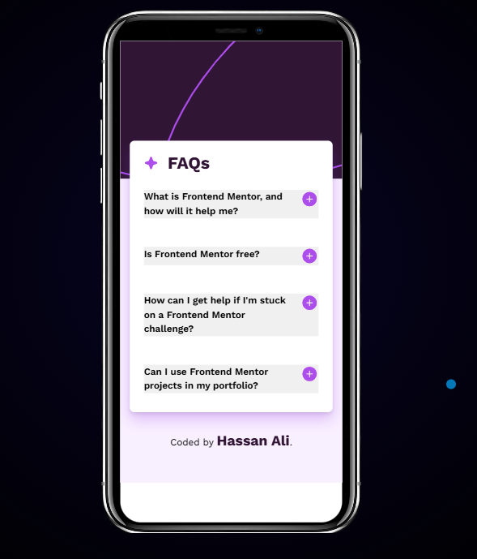
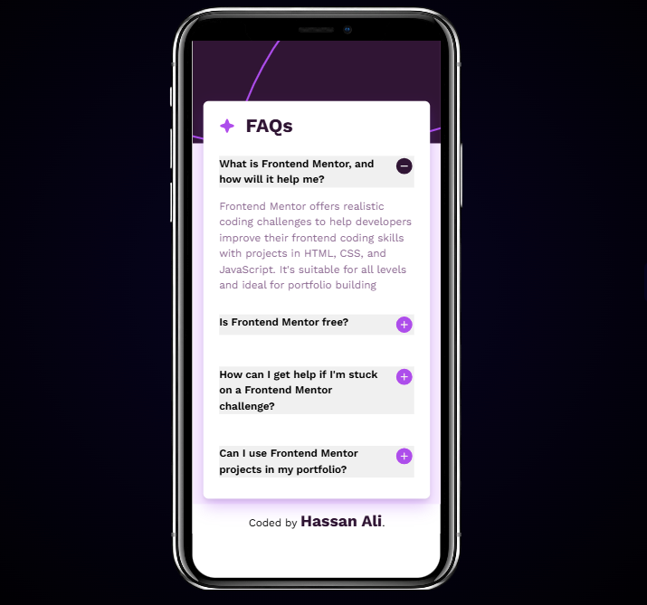
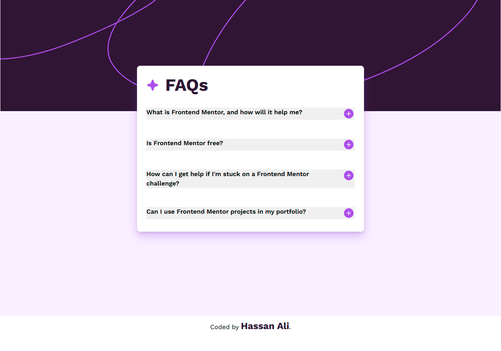

# 🎨 FAQ Accordion

# Frontend Mentor - FAQ Accordion Solution

This is a solution to the [FAQ accordion challenge on Frontend Mentor](https://www.frontendmentor.io/challenges/faq-accordion-wyfFdeBwBz). Frontend Mentor challenges help you improve your coding skills by building realistic projects.

## Project Overview

FAQ Accordion is an interactive web component that allows users to expand and collapse answers to frequently asked questions with smooth transitions and accessible controls.

This project was built to practice:

- DOM manipulation
- Event handling and delegation
- Accessibility best practices
- Component state management for a clean UI

---

## 🌟 Key Features

- Expand/collapse individual FAQ items on click
- Only one FAQ item is open at a time (previous closes automatically)
- Smooth height-based transition animation
- Icon changes from plus to minus on toggle
- Fully keyboard-accessible buttons with ARIA attributes
- Accessible and semantic HTML structure using `<button>`, `<article>`, `<ul>`, `<li>`

---

## 🛠 Tech Stack

- **HTML5** – Semantic markup, accessible elements
- **CSS3** – Variables, grid layout, responsive styling, transitions
- **JavaScript (ES6+)** – Event delegation, DOM traversal, dataset attributes, component state

---

## ⚙ Architecture & Approach

- **Component-based structure:** Each FAQ item is a list item containing a button (question) and a paragraph (answer)
- **Single source of truth for state:** Tracks which FAQ item is currently active
- **Event delegation:** One listener on the parent `<ul>` handles all button clicks
- **Scalable:** Adding a new FAQ requires only HTML changes
- **Separation of concerns:** HTML for structure, CSS for style, JS for behavior

---

## ♿ Accessibility

- Buttons are focusable via keyboard (TAB navigation)
- ARIA attributes:
  - `aria-expanded` indicates open/closed state
  - `aria-controls` links button to its answer element
- Icon images use `aria-hidden="true"` to avoid redundancy for screen readers
- Visible focus outlines preserved for keyboard users
- Semantic elements (`<article>`, `<ul>`, `<li>`, `<button>`, `
`) enhance accessibility

---

## 📚 Learning Outcomes

### Core JavaScript & DOM Skills

- Practiced selecting elements with `querySelector` and `querySelectorAll`
- Used `addEventListener` and event delegation for scalable click handling
- Managed component state to track active FAQ item

### State-Driven UI

- Implemented a single `activeItem` variable to track the open FAQ
- Ensured only one item opens at a time and previous item closes automatically
- Learned to toggle classes (`classList.add`/`remove`) based on state

### CSS & Layout Learnings

- Used `max-height` with overflow hidden to animate expanding answers
- Learned why `max-height: auto` cannot be transitioned
- Removed `place-items: center` from `.faq-item` to ensure smooth animation
- Applied box shadows and responsive typography for polished UI
- Learned to use the `content` property in CSS to dynamically change the icon image
- Used `padding-top` with the `clamp()` function on `<main>` so the FAQ card moves in sync as the background image scales

### Accessibility Awareness

- Added ARIA attributes to buttons and answers (`aria-expanded`, `aria-controls`)
- Marked decorative images with `aria-hidden="true"`
- Learned that accessibility must be considered from the start

### Engineering Mindset

- Iterated from a simple toggle to a state-driven, accessible, and scalable solution
- Learned the importance of a single source of truth for UI state
- Practiced separating structure (HTML), style (CSS), and behavior (JS)
- Gained experience in debugging real-world issues like transition conflicts

---

## 🖥️ Screenshots

### 📱 Mobile View

### 🎯 Active

### 🖥️ Desktop View

---

## 🌐 Live Demo

[Click here to view live demo](https://faq-accordion-js-eight.vercel.app/)

---

## 👨‍💻 Author

Hassan Ali – [GitHub](https://www.frontendmentor.io/profile/hassan-ali-byte)

---

## 💬 Feedback

Feedback, suggestions, and code review comments are always welcome.  
If you have ideas for improving accessibility, scalability, or architecture, feel free to share.

---
